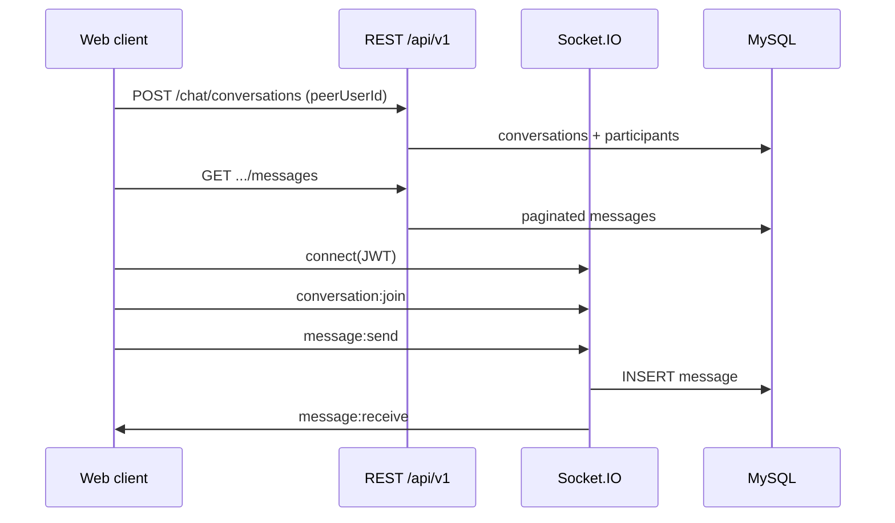

# Chat architecture (plan)

Reference for user-to-user chat: REST + Socket.IO on `services/server` (port 8000).

## Current state

| Layer | Status |
|--------|--------|
| DB | Prisma: `Conversation`, `ConversationParticipant`, `Message`, `MessageStatus`, `Reaction`, `Group`, `Call`, `MediaFile` |
| REST | No `/api/v1/chat/*` yet (auth, users, contacts, blocks only) |
| WebSocket | Socket.IO at `/socket.io`, JWT in `auth.token` |
| Chat socket | Join/send/typing/read in `socket/handlers/chat.handler.js` — broadcast only, no DB, no participant check |
| Web | `ENDPOINTS.CHAT` in `app/web/services/endPoints.ts`; chat UI + socket client TBD |

Use JWT `user.id` (= `users.id` / `auth-user.id`) for `sender_id` and participant `user_id`.

## Flow (1:1)

1. REST: create or find direct conversation with `peerUserId`.
2. REST: load message history (paginated).
3. WS: connect with access token → join `user:{userId}`.
4. WS: `conversation:join` → server verifies participant → room `conversation:{id}`.
5. WS: `message:send` → persist message → `message:receive` to room (+ optional `user:{peer}` if offline from room).
6. WS: `message:read` → update `message_status` / `last_read_at` → broadcast.

**REST** = lists, history, create conversation, uploads.  
**WebSocket** = live messages, typing, presence, read receipts, calls.



## REST API (to implement)

Base: `/api/v1/chat` — all routes require auth middleware.

### Conversations

| Method | Path | Purpose |
|--------|------|--------|
| GET | `/chat/conversations` | Inbox + last message preview / unread |
| POST | `/chat/conversations` | Direct chat `{ peerUserId }` (find or create) |
| GET | `/chat/conversations/:id` | Metadata + participants |
| POST | `/chat/conversations/group` | Group + `groups` row |
| PATCH | `/chat/conversations/:id/read` | Mark read |

Guards: users exist, not blocked, caller is participant.

### Messages

| Method | Path | Purpose |
|--------|------|--------|
| GET | `/chat/conversations/:conversationId/messages` | Cursor pagination |
| POST | `/chat/messages` | Optional HTTP send |
| PATCH | `/chat/messages/:messageId` | Edit |
| DELETE | `/chat/messages/:messageId` | Soft delete / `deleted_for` |

Update `conversations.last_message_at` on new message.

### Media (later)

| Method | Path | Purpose |
|--------|------|--------|
| POST | `/chat/upload` | S3 + `media_files` + message with media type |

## WebSocket events

Defined in `services/server/constants/socketEvents.js`.

| Event | Direction | Purpose |
|--------|-----------|--------|
| `conversation:join` / `leave` | C→S | Join room after participant check |
| `message:send` | C→S | Send (must persist to DB) |
| `message:receive` | S→C | New message payload |
| `message:delivered` / `message:read` | both | Receipts |
| `typing:start` / `typing:stop` | both | Typing indicators |
| `user:online` / `user:offline` | S→C | Presence |
| `call:*` | both | WebRTC signaling |

**Rooms:** `user:{userId}`, `conversation:{conversationId}`.

Client connect:

```ts
import { io } from "socket.io-client";
import { SOCKET_BASE_URL } from "@/services/endPoints";

io(SOCKET_BASE_URL, {
  path: "/socket.io",
  auth: { token: accessToken },
});
```

## Web app plan

1. Connect socket after login; disconnect on logout.
2. Chat list: `GET /chat/conversations` + online events.
3. Thread: REST history + `conversation:join` + listen `message:receive`.
4. Send: optimistic UI + `message:send`; reconcile with server `id`.
5. New chat: contact/search → `POST /chat/conversations`.

## Implementation order

1. `chatService` + REST (direct conversation, list, messages).
2. Socket: participant check + DB on `message:send`.
3. Web: socket provider + list + thread UI.
4. Read/delivered + `message_status`.
5. Groups, media, calls.

## MySQL notes

- `messages`: composite PK `(id, created_at)`; partitioning via manual SQL — see `services/server/prisma/sql/chat_mysql_notes.sql`.
- No FK from partitioned `messages` to `conversations` on MySQL.

## Scale (later)

- Redis adapter for Socket.IO across instances.
- Push notifications for offline users.
